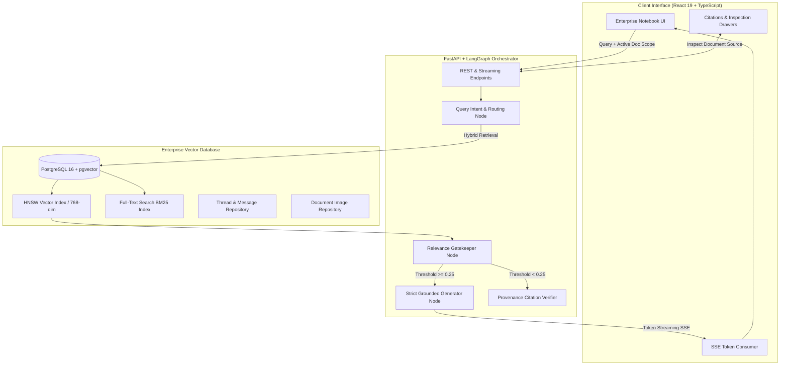

# 🐺 Wise Wolves RAG — Strict Enterprise Knowledge Assistant

[](https://github.com/pgvector/pgvector)
[](https://fastapi.tiangolo.com)
[](https://github.com/langchain-ai/langgraph)
[](https://react.dev)
[](https://www.typescriptlang.org)
[](https://tailwindcss.com)

**Wise Wolves RAG** is an enterprise-grade, document-bounded Retrieval-Augmented Generation (RAG) system engineered to eliminate AI hallucinations with mathematical certainty. Built upon a **fail-closed relevance gatekeeper**, strict HNSW cosine vector search, hybrid retrieval, and real-time Server-Sent Events (SSE) token streaming.

---

## 🌟 Key Capabilities

1. **Fail-Closed Hallucination Barrier**: If retrieved document chunks do not surpass calibrated similarity thresholds, the system halts generation and explicitly reports insufficient grounding rather than fabricating answers.
2. **Multi-Document Dynamic Scoping**: User-selected file isolation allows queries to target specific corporate policies, financial records, or technical documentation.
3. **Multi-Modal Visual Provenance**: Extracts images, diagrams, and tables embedded directly in PDFs, displaying high-resolution visual citations with page, section, and caption context.
4. **Stateful Conversation History**: Persistent thread storage in PostgreSQL with guest mode privacy protection.
5. **Fluid Enterprise UI/UX**: React 19 single-page application with responsive light/dark design token palettes, mobile drawer architecture, live search step indicators, and interactive source inspection drawers.

---

## 🏗️ System Architecture



---

## 👥 Core Creators & Architects

| Architect | Role & Contributions | Profiles |
| :--- | :--- | :--- |
| **Raghaw Shukla** | **AI Systems Engineer & Backend / ML Architect**<br>• Asynchronous FastAPI service & LangGraph multi-node state graph.<br>• PostgreSQL pgvector HNSW indexing & OpenRouter semantic embeddings.<br>• Document ingestion pipeline with visual diagram extraction & fail-closed relevance gates. | [](https://github.com/PyRaghaw) [](https://linkedin.com/in/raghaw-shukla) |
| **Srinjoyee Dey** | **Lead Frontend Architect & Full-Stack Contributor**<br>• Complete frontend engineering from scratch with React 19 & TypeScript.<br>• Real-time SSE token streaming, responsive mobile drawer workspace & bespoke design system.<br>• Full-stack collaboration on backend API endpoints and schema integration. | [](https://www.linkedin.com/in/srinjoyee-dey/) |

---

## 🚀 Quick Start Guide

### Prerequisites
- Python 3.11+
- Node.js 20+
- Docker & Docker Compose (or local PostgreSQL 16 with pgvector)

### 1. Launch with Docker Compose (Fastest)

```bash
# Clone the repository
git clone https://github.com/PyRaghaw/rag_system.git
cd rag_system

# Copy environment template
cp backend/.env.example backend/.env
# (Add your OPENROUTER_API_KEY in backend/.env)

# Spin up Database, Backend, and Frontend
docker-compose up --build
```
- Frontend: `http://localhost:5173`
- Backend API: `http://localhost:8000`
- API Docs (Swagger): `http://localhost:8000/docs`

---

### 2. Manual Local Development

#### A. Backend Setup
```bash
cd backend

# Create & activate virtual environment
python3 -m venv .venv
source .venv/bin/activate

# Install dependencies
pip install -r requirements.txt

# Configure environment
cp .env.example .env
# Fill in OPENROUTER_API_KEY, DATABASE_URL, etc.

# Run database initialization
python scripts/init_db.py

# Launch FastAPI development server
uvicorn app.main:app --reload --host 127.0.0.1 --port 8000
```

#### B. Frontend Setup
```bash
cd frontend

# Install Node dependencies
npm install

# Configure environment
cp .env.example .env

# Launch Vite development server
npm run dev
```

Visit `http://localhost:5173` in your browser.

---

## 🧪 Testing

Run backend tests for database persistence, strict grounding, and routing:
```bash
cd backend
pytest tests/ -v
```

Run frontend build verification:
```bash
cd frontend
npm run build
```

---

## 📄 License
This project is open source and available under the [MIT License](LICENSE).
